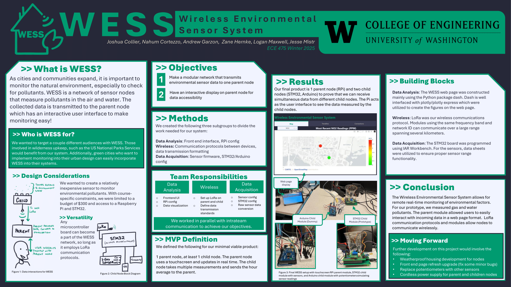

# README - WESS

Welcome to the WESS project. The Wireless Environmental Sensor System is a project designed to make monitoring the environment at wide range easier.
We are developing a prototype for a nodal system of wireless sensors hubs connected to a main parent node that can display the collected data in an intuitive way.

# Running the Frontend
To run the frontend webserver and data collection, we recommend using the 
[runDash.sh](DataAnalysis/runDash.sh) script. You will likely need to modify the paths to point to your python virtual environment,
as well where you install the project files. Note the [requirements.txt](requirements.txt) file lists the python packages necessary. We recommend using [Python 3.10](https://www.python.org/downloads/release/python-3100/) to run the 
frontend, due to dependency issues with some packages.

A slightly modified version of the frontend running on Ploomber web hosting can be found [here](https://tinyurl.com/WESS-app1)

# Developers:
## Data Aquisition
Joshua Collier

Zane Hernke

## Wireless Transmission
Andrew Garzon

Nahum Cortezzo

## Data Analysis
Logan Maxwell

Jesse Mistr
 
 

# Documentation:
## [Images](Images/images.md)

## Poster:

## Report:

<em>The WESS team would like to thank the UW ECE Winter 2025 Embedded Systems Capstone staff  for their invaluable guidance
throughout this project</em>

